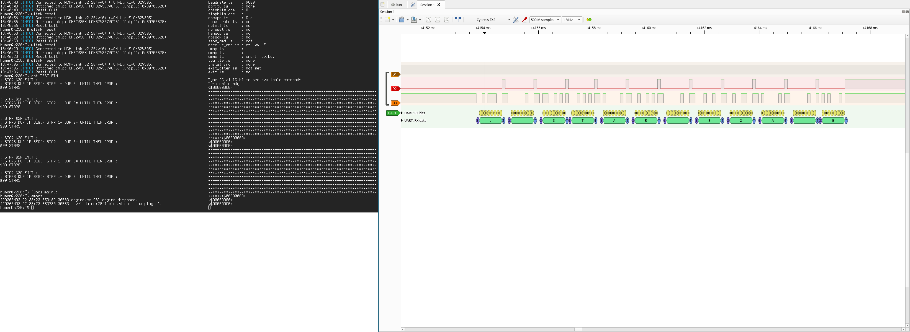

* CH582 USB BRIDGE

** UART SUPPORT

1. HARDWARE FLOW CONTROL USE RTS/CTS

2. PARITY NONE/ODD/EVEN/SPACE/MARK

3. DATABITS 5/6/7/8

4. STOPBITS 1/2

** CORRECT UART HW FLOW CONTROL TIMING

I FOUND THAT MANY POPULAR USB-TO-SERIAL CHIPS HAVE ISSUES WITH THEIR HARDWARE FLOW CONTROL IMPLEMENTATION,

SO I USE CH582 TO IMPLEMENT THE CORRENT RTS/CTS TIMING

D3 is CH582 TXD
D2 is CH582 CTS

*** FTDI HW FLOW CONTROL

https://ftdichip.com/wp-content/uploads/2020/08/DG232_20.pdf

#+BEGIN_SRC text
When RTS/CTS hardware handshaking is enabled CTS# can be used to stop the FT232BM transmitting
data to the MCU / external logic. When CTS# is active ( low ) the FT232BM will transmit any data in it’s
internal buffers. On taking CTS# high, the FT232BM will stop transmitting data. Due to the asynchronous
nature of the interface, there is a latency of 0 to 3 characters between taking CTS# high and data
transmission stopping. The FT232BM drives RTS# high when the available buffer space inside the device
drops below 32 bytes. This allows the MCU / logic to continue to send up to 30 characters to the FT232BM
after RTS# goes high without causing buffer over-run.
#+END_SRC

** LICENSE

MIT
